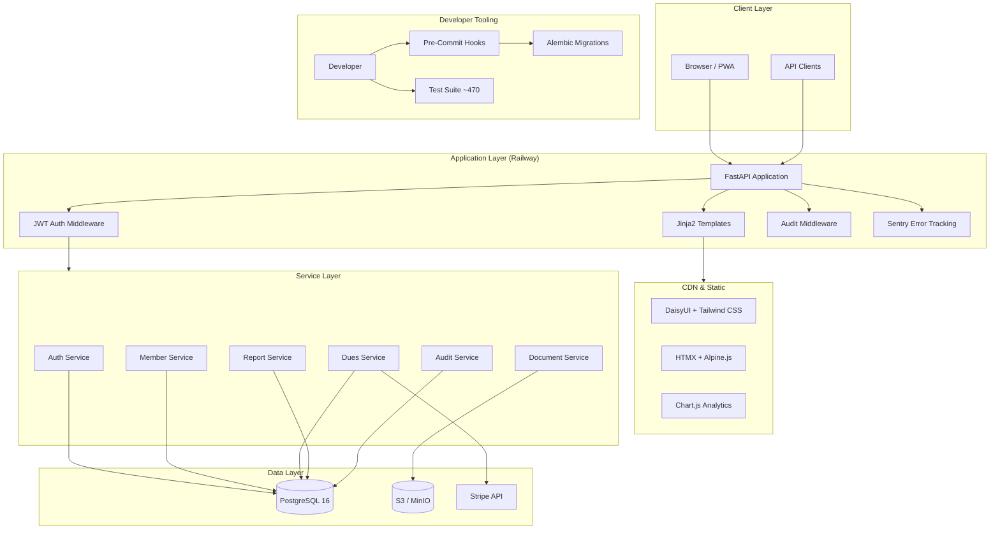

# IP2A Backend Architecture — System Overview

## IP2A Database v2 — Union Operations Management Platform

**Document Created:** January 27, 2026
**Last Updated:** February 3, 2026
**Version:** v0.9.4-alpha (FEATURE-COMPLETE, Weeks 1–19)
**Status:** Production-deployed on Railway

---

## Table of Contents

1. [Overview](#overview)
2. [Current System Stats](#current-system-stats)
3. [Repository Layout](#repository-layout)
4. [Core Principles](#core-principles)
5. [Migration Governance](#migration-governance)
6. [Seeding System](#seeding-system)
7. [Domain Components](#domain-components)
8. [Architecture Diagram](#architecture-diagram)
9. [Deployment Architecture](#deployment-architecture)
10. [Phase 7: What's Next](#phase-7-whats-next)
11. [Related Documentation](#related-documentation)

---

## Overview

The IP2A backend is a **FastAPI + SQLAlchemy + Alembic** application serving as a union operations management platform for **IBEW Local 46** (Seattle-area electrical workers). It manages member records, pre-apprenticeship training, dues tracking, organizing activities, grievances, benevolence fund applications, grant compliance, and (next) out-of-work referral and dispatch.

The system is designed with **preventative safeguards** against schema drift, import breakage, migration regressions, and seed-order corruption. It prioritizes **early failure** over runtime surprises.

**Tech Stack:** Python 3.12 · FastAPI · PostgreSQL 16 · SQLAlchemy 2.x · Jinja2 + HTMX + Alpine.js + DaisyUI · JWT auth (HTTP-only cookies) · Stripe payments · Docker · Railway (production) · WeasyPrint + openpyxl (exports)

---

## Current System Stats

| Metric | Value |
|--------|-------|
| **Version** | v0.9.4-alpha |
| **Status** | Feature-complete (Weeks 1–19) |
| **ORM Models** | 26 |
| **API Endpoints** | ~150 |
| **Total Tests** | ~470 |
| **Frontend Tests** | 200+ |
| **Backend Tests** | 165+ |
| **Production Tests** | ~78 |
| **Stripe Tests** | 25 |
| **ADRs** | 14 |
| **Deployment** | Railway (prod), Render (backup) |
| **Payments** | Stripe (Checkout Sessions + webhooks) |
| **Mobile** | PWA with offline support + service worker |
| **Analytics** | Chart.js dashboard + custom report builder |

---

## Repository Layout

```
src/
├── main.py                     # FastAPI entrypoint
├── config.py                   # Settings and configuration
├── database.py                 # SQLAlchemy engine / session factory
│
├── models/                     # ORM models (26 — single source of truth)
│   ├── user.py                 # User (locked_until datetime, NOT boolean)
│   ├── role.py                 # Role + permissions JSON
│   ├── user_role.py            # User-Role junction (Association Object)
│   ├── refresh_token.py        # JWT refresh tokens
│   ├── member.py               # Union member (SEPARATE from Student)
│   ├── member_employment.py    # Employment history
│   ├── member_note.py          # Staff notes with visibility levels
│   ├── student.py              # Training program student (FK → Member)
│   ├── course.py               # Training courses
│   ├── cohort.py               # Course cohorts/sections
│   ├── enrollment.py           # Student-Cohort enrollment
│   ├── grade.py                # Student grades
│   ├── instructor.py           # Instructors
│   ├── instructor_cohort.py    # Instructor-Cohort (Association Object)
│   ├── organization.py         # Employers/contractors
│   ├── salt_activity.py        # SALTing/organizing activities
│   ├── benevolence_application.py  # Financial assistance
│   ├── grievance.py            # Grievance tracking
│   ├── document.py             # File/document metadata
│   ├── audit_log.py            # Immutable audit trail (NLRA compliant)
│   ├── dues_rate.py            # Dues rate definitions
│   ├── dues_period.py          # Billing periods
│   ├── dues_payment.py         # Payment records
│   ├── dues_adjustment.py      # Payment adjustments
│   └── grant_enrollment.py     # Grant compliance tracking
│
├── schemas/                    # Pydantic schemas (request/response)
│   ├── user.py, member.py, student.py, dues.py, ...
│   └── common.py               # Shared schemas (pagination, etc.)
│
├── services/                   # Business logic layer (~18 services)
│   ├── auth_service.py         # Login, registration, JWT management
│   ├── user_service.py         # User CRUD
│   ├── member_service.py       # Member CRUD
│   ├── student_service.py      # Student CRUD
│   ├── enrollment_service.py   # Enrollment management
│   ├── salt_service.py         # SALT activity management
│   ├── benevolence_service.py  # Benevolence fund
│   ├── grievance_service.py    # Grievance tracking
│   ├── document_service.py     # File upload/download (S3/MinIO)
│   ├── audit_service.py        # Audit logging (AUDITED_TABLES list)
│   ├── dues_service.py         # Dues calculation and tracking
│   ├── dues_frontend_service.py    # Frontend helpers for dues UI
│   ├── audit_frontend_service.py   # Role-filtered audit queries
│   ├── member_note_service.py  # Member notes CRUD
│   ├── report_service.py       # Report generation (PDF/Excel)
│   └── task_service.py         # Abstract background tasks
│
├── routers/                    # API endpoints (~150 routes)
│   ├── auth.py                 # /auth/*
│   ├── users.py                # /users/*
│   ├── members.py              # /members/*
│   ├── students.py             # /students/*
│   ├── courses.py              # /courses/*
│   ├── enrollments.py          # /enrollments/*
│   ├── salt.py                 # /salt/*
│   ├── benevolence.py          # /benevolence/*
│   ├── grievances.py           # /grievances/*
│   ├── documents.py            # /documents/*
│   ├── dues.py                 # /dues/*
│   ├── audit.py                # /admin/audit-logs/*
│   ├── member_notes.py         # /members/{id}/notes/*
│   ├── reports.py              # /reports/*
│   └── frontend.py             # Frontend page routes (Jinja2)
│
├── db/
│   ├── enums/                  # ALL enums defined here
│   │   ├── __init__.py         # Central import point
│   │   ├── user_enums.py
│   │   ├── member_enums.py
│   │   ├── dues_enums.py
│   │   └── ...
│   └── seed.py                 # Seed data (roles, admin user, etc.)
│
├── middleware/
│   ├── auth_middleware.py      # JWT verification
│   └── audit_middleware.py     # Audit context injection
│
├── templates/                  # Jinja2 frontend templates
│   ├── base.html               # Master layout (DaisyUI + HTMX + Alpine)
│   ├── components/             # Reusable partials (_sidebar, _navbar, etc.)
│   ├── auth/                   # Login, register
│   ├── dashboard/              # Main dashboard with metrics
│   ├── members/                # Member list, detail, search, notes
│   ├── students/               # Student list, detail
│   ├── staff/                  # Staff management
│   ├── training/               # Training program landing
│   ├── union_ops/              # Union operations landing
│   ├── dues/                   # Dues management (rates, payments)
│   ├── reports/                # Reports landing
│   ├── documents/              # Document management
│   ├── admin/                  # Audit logs, admin tools
│   └── errors/                 # 404, 500 pages
│
├── static/                     # CSS, JS, service worker, manifest
│
└── tests/                      # Test suite (~470 tests)
    ├── conftest.py             # Fixtures, test DB setup
    ├── test_auth.py
    ├── test_members.py
    ├── test_frontend.py        # Frontend route tests (200+)
    └── ...
```

---

## Core Principles

### 1. Single Source of Truth
- **Models define reality** — SQLAlchemy models are the canonical schema
- Alembic migrations must align with models
- Drift is detected automatically via validation scripts

### 2. Fail Fast
- Import graph validated before app start
- Migrations validated before commit
- Seeds validated before execution

### 3. Legacy Respect, Forward Discipline
- Legacy migrations allowed but frozen
- New migrations must follow strict naming + safety rules

### 4. Entity Separation
- **Member** is SEPARATE from **Student** (Student has FK → Member)
- **User** model uses `locked_until` datetime field (NOT a boolean `is_locked`)
- **Instructor-Cohort** uses Association Object pattern (not simple M2M table)

### 5. Enums Are Centralized
- All enums live in `src/db/enums/` and are imported via `from src.db.enums import ...`
- Never define enums inline in models or services

---

## Migration Governance

### Naming Rules

| Type | Format |
|------|--------|
| Bootstrap | `0001_baseline.py` (frozen) |
| Legacy | `<hash>_description.py` |
| New | `YYYYMMDDHHMMSS_description.py` |

### Breaking Change Rules

Blocked unless explicitly acknowledged:
- `op.drop_table`
- `op.drop_column`
- `op.alter_column`

Override requires adding a `# BREAKING_OK` comment with justification.

### Drift Detection

- **Online Drift** — Requires live database, used in CI, detects actual schema mismatch
- **Offline Drift** — No database required, used in pre-commit, detects model vs migration divergence

### Enforcement Layers

| Layer | Tool |
|-------|------|
| Local dev | pre-commit hooks (Ruff linting, offline drift) |
| CI | GitHub Actions |
| Runtime | preflight checks |

---

## Seeding System

- **Registry-based ordering** — Seeds run in dependency-aware order
- **Environment protected** — PROD seeding hard-blocked unless forced
- **Validation** — Seed integrity checked before execution

Default seeds include: system roles (admin, officer, staff, organizer, instructor, member, applicant), admin user, and reference data.

---

## Domain Components

### Phase 1: Core Member Management ✅ IMPLEMENTED
- **Organizations** — Employers, unions, JATCs
- **Members** — Union members with classifications (separate from Students)
- **Member Employments** — Employment history tracking
- **Member Notes** — Staff notes with visibility levels (private, staff, admin)
- **Audit Logs** — Comprehensive change tracking with immutability trigger (NLRA 7-year compliance)

### Phase 2: Union Operations ✅ IMPLEMENTED
- **SALTing Activities** — Organizing campaigns with employer receptiveness scores (1–5 scale)
- **Benevolence Applications** — Financial assistance with approval workflow
- **Grievances** — Formal complaint tracking through multi-step process

### Phase 3: Pre-Apprenticeship Training ✅ IMPLEMENTED
- **Students** — Training program participants (FK → Member for graduated students)
- **Courses** — Training course definitions
- **Cohorts** — Course sections with scheduling
- **Enrollments** — Student-Cohort links with status tracking
- **Grades** — Assessment results
- **Instructors** — Instructor records with Cohort assignments (Association Object pattern)
- **Grant Enrollments** — Grant compliance tracking with outcome reporting

### Phase 4: Document Management ✅ IMPLEMENTED
- **Documents** — File metadata with S3/MinIO storage backend
- Presigned URLs for secure access
- File validation, soft delete, and entity-based organization
- Transitioning from local filesystem to S3/cloud storage

See [FILE_STORAGE_ARCHITECTURE.md](FILE_STORAGE_ARCHITECTURE.md) for design details.

### Phase 5: Dues Tracking ✅ IMPLEMENTED
- **Dues Rates** — Classification-based pricing
- **Dues Periods** — Monthly billing cycles
- **Dues Payments** — Payment records with Stripe integration
- **Dues Adjustments** — Waivers, credits with approval workflow

See [ADR-008: Dues Tracking System](../decisions/ADR-008-dues-tracking-system.md) for design details.

### Phase 5.1: Authentication & Authorization ✅ IMPLEMENTED
- **JWT Authentication** — Access + refresh tokens via HTTP-only cookies
- **Role-Based Access Control** — Admin, Officer, Staff, Organizer, Instructor, Member, Applicant
- **Account Security** — Lockout via `locked_until` datetime, login history, bcrypt hashing
- **Frontend Auth** — Cookie-based JWT for Jinja2 browser sessions

See [AUTHENTICATION_ARCHITECTURE.md](AUTHENTICATION_ARCHITECTURE.md) and [ADR-003: JWT Auth](../decisions/ADR-003-jwt-auth.md).

### Phase 5.2: Stripe Payment Integration ✅ IMPLEMENTED (Week 11)
- **Checkout Sessions** — Stripe-hosted payment pages for dues
- **Webhooks** — Real-time payment event processing
- **NLRA-Compliant Audit Logging** — Immutable payment audit trail with triggers
- **Test Coverage** — 25 dedicated Stripe tests

See [ADR-013: Stripe Integration](../decisions/ADR-013-stripe-integration.md).

### Phase 6: Frontend ✅ IMPLEMENTED (Weeks 1–19)
- **Templates** — Jinja2 with DaisyUI + Tailwind CSS (CDN delivery, no build step)
- **Interactivity** — HTMX for HTML-over-the-wire, Alpine.js for micro-interactions
- **Dashboard** — Real-time stats from all modules with Chart.js analytics
- **Full CRUD** — All entity types have list/detail/create/edit views
- **Mobile PWA** — Service worker, offline support, touch-friendly UI, bottom navigation (Week 18)
- **Analytics Dashboard** — Chart.js membership trends, dues analytics, custom report builder (Week 19)
- **Routing** — Frontend router with auth middleware and role-based view filtering

See [ADR-002: Frontend Framework](../decisions/ADR-002-frontend-framework.md) and [ADR-005: CSS Framework](../decisions/ADR-005-css-framework.md).

### Phase 6.1: Production Hardening ✅ IMPLEMENTED (Week 16)
- **Security Headers** — CSP, HSTS, X-Frame-Options, etc.
- **Error Tracking** — Sentry integration for production monitoring
- **Structured Logging** — JSON-formatted logs with correlation IDs
- **Connection Pooling** — SQLAlchemy pool configuration for production loads
- **32 production tests** validating hardening measures

### Phase 6.2: Post-Launch Operations ✅ IMPLEMENTED (Week 17)
- **Backup Scripts** — Automated database backup with retention policies
- **Admin Metrics** — System health dashboard for administrators
- **Incident Response Runbook** — Documented procedures for common failure scenarios
- **13 operational tests** validating backup/restore flows

### Phase 6.3: Grant Compliance Reporting ✅ IMPLEMENTED (Week 14)
- **GrantEnrollment Models** — Outcome tracking per student per grant
- **Compliance Reports** — PDF/Excel export capabilities via WeasyPrint + openpyxl
- **~20 compliance tests** validating reporting accuracy

### Phase 7: Referral & Dispatch 🔜 NEXT
- **Out-of-Work List** — Book-based referral system per Local 46 rules
- **Dispatch Management** — Job call processing and member referral
- **LaborPower Report Parity** — ~78 reports (16 P0, 33 P1, 22 P2, 7 P3)

See [Phase 7 Planning Docs](../phase7/) for details.

---

## Architecture Diagram



---

## Deployment Architecture

### Production: Railway
- **API** — Dockerized FastAPI application
- **Database** — Railway-managed PostgreSQL 16
- **Environment** — Production secrets via Railway environment variables
- **Branch** — Deploys from `main` branch

### Backup: Render
- **Secondary deployment** for redundancy during leadership demonstrations
- Same Docker image, separate database instance

### Local Development
- **Docker Compose** — API, PostgreSQL, MinIO (S3-compatible object storage)
- **DevContainer** — VS Code devcontainer support
- **Pre-commit** — Ruff linting, migration validation, seed integrity checks

### Branch Strategy
- `main` — Stable, production-deployed (demo-ready)
- `develop` — Active development work (currently at v0.9.4-alpha)
- Merge `develop → main` when ready for production deployment

---

## Phase 7: What's Next

The next major development phase is the **Referral & Dispatch System**, which will implement the out-of-work list and job dispatch functionality currently handled by the legacy LaborPower system. This involves:

- ~78 new reports to achieve parity with LaborPower (16 P0 critical, 33 P1 high, 22 P2 medium, 7 P3 low)
- New database models for referral books, job calls, and dispatch records
- Integration with existing member and organization records
- Real-time dispatch queue management

See `docs/phase7/` for comprehensive planning documents.

---

## Related Documentation

| Document | Description |
|----------|-------------|
| [AUTHENTICATION_ARCHITECTURE.md](AUTHENTICATION_ARCHITECTURE.md) | JWT auth, RBAC, account security |
| [FILE_STORAGE_ARCHITECTURE.md](FILE_STORAGE_ARCHITECTURE.md) | S3/MinIO file storage design |
| [SCALABILITY_ARCHITECTURE.md](SCALABILITY_ARCHITECTURE.md) | Connection pooling, caching, scaling plans |
| [AUDIT_ARCHITECTURE.md](AUDIT_ARCHITECTURE.md) | Immutable audit trail, NLRA compliance |
| [ADR Index](../decisions/README.md) | All 14 Architecture Decision Records |
| [Phase 7 Plan](../phase7/PHASE7_REFERRAL_DISPATCH_PLAN.md) | Referral & Dispatch system design |

---

> **⚠️ SESSION RULE — MANDATORY:**
> At the end of every development session, update *ANY* and *ALL* relevant documents to capture progress made. Scan `/docs/*` and make or create any relevant updates/documents to keep a historical record as the project progresses. Do not forget about ADRs — update as necessary.
> See `/docs/standards/END_OF_SESSION_DOCUMENTATION.md`

---

*Document Version: 2.0*
*Last Updated: February 3, 2026*
*Previous Version: 1.0 (January 27, 2026 — pre-implementation spec)*
